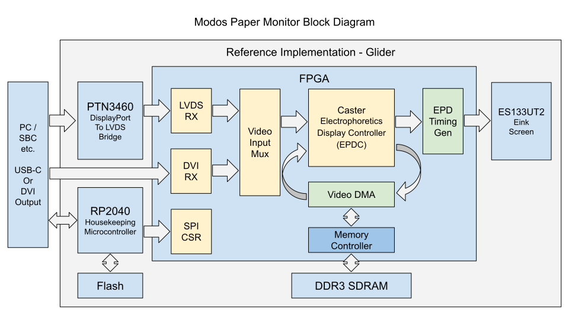

# Glider

Open source E-ink monitor with an emphasis on low latency.

Note: This repo only contains the hardware design, the gateware running on the FPGA is our open-source Caster EPDC design, which could be found at [github.com/Modos-Labs/Caster](https://github.com/Modos-Labs/Caster/)

## Feature

- Xilinx(R) Spartan-6 LX16 FPGA running Caster
- DDR3-800 framebuffer memory
- Type-C DisplayPort Alt-Mode video input with on-board PTN3460 DP-LVDS bridge or
- DVI (via HDMI connector) video input
- Epaper power supply with up to 1A peak current on +/-15V rail supporting large panels
- VCOM kick-back voltage measurement support
- On-board RaspberryPi(R) RP2040 microcontroller for USB communication and firmware upgrade
- Up to 133MP/s processing rate with dithering enabled, >200MP/s when disabled

## License

The hardware design is released under the CERN Open Source Hardware License strongly-reciprocal variant, CERN-OHL-S. A copy of the license is provided in the source repository. Additionally, user guide of the license is provided on ohwr.org.
