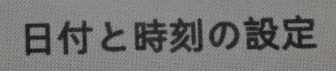

# Glider

Open-source Eink monitor with an emphasis on low latency.

Note: This repo only contains the hardware design, the gateware running on the FPGA is my open-source [Caster EPDC](https://gitlab.com/zephray/Caster/) design. This README also contains information about the Caster as well.


This is a long document, containing not just information about this project, but also pretty much everything I know about Eink. Given it's a bit hard to gather information about Eink online, I think this is the right thing to do. Use the following table of contents to navigate around.

Eink is a registered trademark and brand of E Ink Corporation. All the contents provided in this repo are based on publicly available information online and original research. They are not endorsed by Eink in any way and they may contain errors and/ or inaccuracies. 

If you're interested in attaining a board, or the reference monitor, see and subscribe to the [pre-launch page for the Modos Paper Monitor on Crowd Supply](https://www.crowdsupply.com/modos-tech/modos-paper-monitor) for updates.

If you are interested in Eink or any other display technologies, I have a Discord server for that. Feel free to join: https://discord.gg/rtT7euSHQS . (This Discord server is also not endorsed by Eink or any other company. It's not a customer support server.)

## Table of Contents 

- [Overview](#overview)
    - [Features](#features)
    - [Hardware](#hardware)
    - [Components](#components)
- [Eink Screens](#eink-screens)
    - [Basic Theory of Operation](#basic-theory-of-operation)
    - [Advantages and Disadvantages](#advantages-and-disadvantages)
    - [The Role of Eink Controller](#the-role-of-eink-controller)
    - [Screen Panel Types](#screen-panel-types)
    - [Using Screen with Integrated Controller](#using-screen-with-integrated-controller)
    - [Using Screen without Integrated Controller](#using-screen-without-integrated-controller)
    - [Understanding Waveform](#understanding-waveform)
    - [Greyscale Display](#greyscale-display)
    - [Color Display](#color-display)
    - [Dithering](#dithering)
    - [Eink Screen Generations](#eink-screen-generations)
- [Caster/ Glider Design](#design-of-caster-and-glider)
    - [Low Latency Drive](#low-latency-drive)
    - [Hybrid Greyscale Mode](#hybrid-greyscale-mode)
    - [Limitations](#limitations)
    - [Hardware Design Decisions]()
    - [Gateware Architecture](#gateware-architecture)
    - [Firmware Functions](#firmware-functions)
    - [Resources Utilization](#resources-utilization)
- [Building](#building)
    - [PCB](#pcb)
    - [FPGA Bitstream](#fpga-bitstream)
    - [MCU Firmware](#mcu-firmware)
    - [Working with Waveforms](#working-with-waveforms)
    - [Compatible Screens](#compatible-screens)
- [References](#references)
- [License](#license)
- [Appendix](#appendix)
    - [Using Screens without Datasheet](#using-screens-without-datasheet)
    - [Screen List](#screen-list)

## Overview

### Features

- Complete solution for low-latency/ high-refresh-rate EPD monitor
- Supports electrophoretic display panels with parallel I/F (Eink(R), SiPix and DES)
- Supports both monochrome and color-filter-array (such as Kaleido(TM)) based color screen
- Extremely low processing delay of \<20 us
- Supports binary, 4-level grayscale, and 16-level grayscale output modes
- Latency-optimized binary and 4-level grayscale driving modes
- Hybrid automatic binary and 16-level grayscale driving mode
- Host software runtime controllable regional update and mode switching
- Hardware bayer dithering, blue-noise dithering, and error-diffusion dithering with no additional latency
- Controller natively supports FPD-Link (LVDS), DVI (TMDS), and MIPI-DSI input
- Board-level design supports USB-C (USB Type-C DisplayPort Alt Mode) and DVI input

### Hardware


- Xilinx(R) Spartan-6 LX16 FPGA running Caster
- DDR3-800 framebuffer memory
- Type-C DisplayPort Alt-Mode video input with onboard PTN3460 DP-LVDS bridge or
- DVI (via microHDMI connector) video input with onboard ADV7611 decoder
- Epaper power supply with up to 1A peak current on +/-15V rail supporting large panels
- VCOM kick-back voltage measurement support
- On-board RaspberryPi(R) RP2040 microcontroller for USB communication and firmware upgrade
- Up to 133MP/s processing rate with dithering enabled, >200MP/s when disabled

The board is designed with KiCad. You may need the latest stable version of KiCad to open the source file.

### Components

This repo hosts the PCB design, firmware source code, and a reference 3D-printable case design. The RTL code is in a separate repo: [https://gitlab.com/zephray/Caster/](https://gitlab.com/zephray/Caster/).

## Eink Screens

Eink is the brand of a family of paper-like electrophoretic displays. The underlying technology is invented in the MIT Media Lab between 1995 and 1997 by Barrett Comiskey, J.D. Albert, and Joseph Jacobson. They later founded the E Ink Corporation to commercialize this technology.

Nowadays they are commonly used on e-readers and electronic shelf labels. You’ve probably seen them on Kindle, in stores, or maybe in some train stations as well.

| eReader/ Tablets | Electronic Shelf Label | Digital Signage |
|-|-|-|
|  |  |  |

(Source: https://www.eink.com/application, image copyright Eink corporation)

This section gives an overview of the electrophoretic displays, including the screen panels available and underlying technology. Note this project doesn't and can't support all electrophoretic screens. This documentation also solely focuses on using existing off-the-shelf screen panels rather than the physics or manufacturing process of one.

### Basic Theory of Operation

In the simplest form, you have charged particles with different colors, dispersed in some oil in some transparent container. By applying electric fields the particles can be moved up or down to produce either black or white, or a mixture of that.


(Source: https://www.eink.com/tech/detail/How_it_works , copyright Eink Corporation)

There are multiple technologies based on this basic concept, namely Eink’s micro-capsule display, SiPix (now acquired by Eink)’s micro-cup display, and WFT’s DES display. They differ in specific ways of confining the particles in containers, but otherwise very similar.

The pixels on the screen are typically arranged as a 2D array, driven with TFTs. The pixels are scanned/ driven periodically at a fixed refresh rate, typically ranging from 50Hz to 120Hz. Applying positive voltage on the pixel will typically drive the particles toward the white state while applying negative voltage will drive the particles towards the black state. This is similar to active matrix TN/IPS LCDs, which also use 2D TFT arrays and electrical fields for changing state. However, unlike LCDs, EPDs maintain their state after the electrical field is removed. So unlike LCDs which require continuous refreshing, the EPDs only need to be refreshed till the pixels are fully driven.

In terms of driving the screen panel, depending on the pixel value (1 or 0), each pixel would be driven either with a positive voltage or a negative voltage. A global counter can be used to count the frames elapsed and stop driving the pixels after a predefined period of time (for example, 100ms). Two framebuffers are typically used for determining if the pixel has changed color or not. If not, then the pixel does not need to be driven.

### Advantages and Disadvantages

In terms of display quality, EPDs are no match for modern IPS LCDs. The following is a comparison table of key parameters. The specific number would vary depending on the screen used but should be within the same ballpark.

| | Monochrome EPD | CFA-based Color EPD | Transmissive TFT IPS LCD | Reflective TFT TN LCD |
|-|-|-|-|-|
| Contrast Ratio | ~17:1 | ~14:1 | ~1000:1 | ~14:1 |
| Colors | 16 (Greyscale) | 4096 | 16M | 256 |
| Color Gamut | N/A | ~1.5% sRGB | ~99.9% sRGB | N/A |
| Reflectivity | ~45% | ~25% | N/A | ~15% |
| Response Time | ~150ms | ~150ms | ~10ms | ~15ms |

It has a few advantages. It reflects lights instead of emitting lights, so it generally consumes less power and can be used outdoors, etc. It’s also bistable, which means that it retains the image after the power has been removed. Personally, the biggest differentiating factor for me (author of this README) is that it looks like paper.


The image above shows a comparison between reflective TFT LCD (SHARP memory LCD in this case) and Eink. The LCD has a mirror-like texture which changes reflectivity drastically in different angles, while the Eink is more paper-like.

| ZBD LCD | Ch LCD | STN LCD |
|-|-|-|
|  |  |  |
| Bistable, reflective, high contrast, no greyscale, ~10s refresh | Bistable, reflective, lower contrast, up to 32 level greyscale, ~5s refresh | Volatile, reflective, lower contrast, up to 32 level greyscale, ~100ms response |

There are many other reflective or bistable display technologies. They are all interesting displays on their own, but none of them feels like paper (yet).

Overall, there is no single perfect display technology. Each has its own unique strength. Pick the right one for your project.

### The Role of Eink Controller

The Eink controller is in some ways similar to the display controller (DC/ CRTC) + timing controller (TCON) in a typical LCD-based system. It takes the raw image data and converts it to signals required to drive the screen.


To understand the actual work of an eink controller, start from the basic concept. The color of a pixel can be changed by applying positive or negative voltage for a finite period of time. From the controller’s perspective, depending on the current state of the pixel and the desired state of the pixel, there are 4 possibilities.

| Current State | Target State | Action |
|-|-|-|
| Black | Black | No operation |
| Black | White | Apply positive voltage |
| White | Black | Apply negative voltage |
| White | White | No operation |

The controller needs to store and maintain the screen state inside of its own buffer memory, so it would typically have a large on-chip SRAM or an off-chip SDRAM controller. The controller should also have a timer to ensure the screen doesn't get overdriven or underdriven.

The controller often uses the so-called "[waveform](#understanding-waveform)" to replace the action column of the previous table. Instead of hardcoding the action for state transition, the actions are stored into a look-up-table (LUT) which can be modified at runtime to allow higher flexibility.

Controllers may also offer more advanced features such as [dithering](#dithering) acceleration, multiple region updates, automatic LUT selection, etc.

### Screen Panel Types

As discussed in the previous section, an Eink screen needs to be coupled to an Eink controller to function. Aside from that, the screen also needs high-voltage drivers to drive the TFTs and the pixels. Virtually all E-paper panels use either COG (Chip-on-Glass) or TAB (Tape Auto Bonding) to integrate some chips onto the screen panel itself. Most of the screens available today can be divided into two categories based on whether or not the controller is integrated in:


Here is a non-exhaustive list of the types based on their size: (the size or resolution is not related to or limited by the type, it is just for a certain size, and the vendors tend to make them the same type.)

- Screens without controller: 4.3", 6.0", 7.8", 8.0", 9.7", 10.3", 13.3", 25.3", 31.2", 42"
- Screens with controller: 1.02", 1.54", 2.13", 2.6", 2.9", 3.71", 4.2", 5.65", 5.83", 7.5", 12.48"

One may notice that almost all e-readers/ e-ink cellphones use screens without controllers, while almost all e-ink electronic shelf labels (ESL) use screens with controllers. This gives some hints about the advantages and disadvantages of two types:

| | Without Controller | With Controller |
|-|-|-|
| System Cost | High. A dedicated controller or SoC with an integrated controller is usually required. Needs a dedicated power supply. | Low. Virtually any MCU could drive the screen directly, and the power supply is integrated in. |
| Greyscale Levels | Generally 16 (4bpp), up to 32 (5bpp) | Generally 2 (BW only) or 4 (2bpp), with some hack, up to 16 (4bpp) |
| Refresh Speed | Generally fast (100ms~300ms) for BW. Depends on the screen used and the system architecture | Generally fast (100ms~300ms) for BW if the partial refresh is enabled. Greyscales are much slower, BWR or BWY screens would be even slower.
| Total Update Latency | Generally the same as refresh time. Depends on the system architecture | Slow. Ranging from 100ms to several seconds based on the resolution. |

Please keep in mind the discussion is about off-the-shelf screens you can buy today. These tradeoffs do not necessarily come from the fact the controller is integrated or not.

Note that I mentioned the refresh speed and total update latency. They are different:

The refresh speed refers to the time it takes to start refreshing the screen: from starting to seeing screen changing, to the screen finish showing the new content.

The total update latency refers to the latency when the processor needs to update the screen, to the screen finish showing the new content. As you can see, this is the biggest issue for screens with controllers. This is the main reason why they are rarely used on e-readers cell phones or PC monitors.


This diagram illustrates the difference between the two. It should be noted that the screens without controllers have the flexibility to be driven quickly, but the system designer might not architect the system for low latency.

### Using Screen with Integrated Controller

Screens with integrated controllers have almost everything already integrated. Common display panels of this type only need a few external capacitors, inductors, and MOSFETs to support the integrated bipolar power supply circuit, then it could be hooked up to MCUs or MPUs using common interfaces like SPI or I2C. There are a lot of driving boards and examples of these screens available online.

To be expanded (TODO)

### Using Screen without Integrated Controller

This could get complicated. Note I used a lot of "generally" in the previous comparison table because there are many things one could do to drive them. Some of them would certainly impact the performance. The main issue here is the controller chip. There are three solutions to drive these screens:

- Using a dedicated controller chip to drive the screen
- Using an SoC that has an integrated controller
- Using a fast MCU/SoC to emulate the controller with GPIO (software timing controller)

Then, again here is a comparison between them:

| | Specialized controller chip | SoC with integrated controller | MCU + Software TCON |
|-|-|-|-|
| Resolution | UXGA+ | UXGA+ | Limited by MCU RAM. Up to XGA with SRAM, UXGA with PSRAM, UXGA+ with DDR |
| Greyscale | Up to 32 | Up to 32 | Up to 32 |
| Partial Update | Yes | Yes | Yes |
| Total Update Latency | Depends. Could be very close to refresh speed, could be slow like screens with controller | Same as refresh speed | Same as refresh speed if data is internally generated (not streaming from an external device such as a PC) |
| Suitable Applications | IoT devices, E-readers, cellphones, E-ink monitors. possibly E-ink laptops | Advanced IoT devices, E-readers, cellphones, E-ink typewriters, possibly lower performance E-ink laptops | When using MCU: IoT devices, large ESLs, simple DIY E-readers. When using MPU: Same as SoC with integrated controller |

When using a dedicated controller, it could accept data from external devices. This allows it to be used in various different types of applications. Ranging from IoT devices, and ESLs, to PC monitors with relatively fast refresh rate and low latency.

When using SoC or MCU, the display content is generated by the SoC or MCU itself, which ultimately is limited by the capability of the SoC or MCU. Given the current SoCs with E-ink display controllers are usually limited in performance, the application is limited. The same goes for MCU, it does what an MCU could do. You could find ways to stream video data into SoC or MCUs by using USB, camera interface, WiFi, etc., but this might not be optimal.

#### Existing Solutions

- Specialized controller chip
    - Closed-source
        - EPSON S1D13xxx: Widely used EPD controller in early E-readers. Proprietary, no documents available. Probably EOL.
        - IT8951: Used on the waveshare EPD Hat. Documents are available. It works with large EPDs up to 2048x2048. The drawback is the speed as the interface between processor and IT8951 could be slow. This is similar to the situation on screens with integrated controller
        - T1000: Also known as IT8957, upgraded model of IT8951. It supports even higher resolution. It features a higher speed MIPI DSI interface to mitigate the slow speed of IT8951.
        - Waveshare HDMI driver board: FPGA-based controller. Closed source but easily purchasable, could be integrated into larger projects as a module.
    - Open-source
        - This project (Caster + Glider): FPGA-based controller, multiple update modes, ultra-low latency processing, and wide range of screen support.
        - https://hackaday.io/project/21607-paperback-a-desktop-epaper-monitor: FPGA-based controller. However, doesn't support partial update mode and slower speed.
        - https://hackaday.io/project/21168-fpga-eink-controller: FPGA-based controller supports vendor waveform with reasonable speed.
- SoC with integrated controller
    - RK29xx: Fairly old, Cortex-A8 based (RPi 1 level performance), 55nm, EOL
    - RK3026/RK3028: Fairly old, Cortex-A9 based (RPi 2 level performance), 40nm, EOL
    - i.MX 50: Fairly old, Cortex-A8 based (RPi 1 level performance), 65nm, in production
    - i.MX 6ULL: Cortex-A7 based (RPi 1 level performance), 40nm, in production
    - i.MX 6S/D: Fairly old, Cortex-A9 based (RPi 2-3 level performance), 40nm, in production
    - i.MX 7S/D: Cortex-A7 based (RPi 2 level performance), 28nm, in production
    - i.MX 8ULP: Cortex-A35 based (RPi 2 level performance), 28nm FD-SOI, in production
    - AW B200: Cortex-A53 based (RPi 2 level performance), 28nm, in production
    - MT8113: Cortex-A53 based (RPi 2 level performance), 12nm, in production
    - RK3566/RK3568: Cortex-A55 based (RPi 3 level performance), 22nm, in production
    - RK3576: Cortex-A72 + A53 based (RPi 4-5 level performance), 8nm, in production
- MCU/SoC + Software TCON
    - http://essentialscrap.com/eink/waveforms.html: One of the earliest e-ink hacks. Limited in performance but still could be used as a reference
    - NekoCal: One of the earliest e-ink software TCON with greyscale support. Used to be available as a DIY kit. No longer updated, still could be used as a reference
    - InkPlate 6/10: Commercially available. Based on ESP32.
    - EPDiy: Based on ESP32, supports a lot of different screens, recommended if want to build some device with ESP32+Eink or embed it into a larger project.

#### Interface Signals and Timing

The interface signals and timing are fairly similar to LCDs without a controller. Following is the list of signals typically found on EPDs:

- GDOE/ MODE: Gate driver output enable
- GDCLK/ CKV: Gate driver clock (like HSYNC in LCD)
- GDSP/ SPV: Gate driver start pulse (like VSYNC in LCD)
- SDCLK/ XCL: Source driver clock (like PCLK in LCD)
- SDLE/ XLE: Source driver latch enable (like HSYNC in LCD)
- SDOE/ XOE: Source driver output enable
- SDCE/ XSTL: Source driver start pulse (like DE in LCD)
- SD: Source driver data (8-bit or 16-bit)

SD signals go into the source driver, typically in the X direction. GD signals go into the gate driver, typically in the Y direction. It's a 2D array, the gate driver selects one line at a time, and the source driver outputs the voltage for all the pixels in that line.

Conceptually, it's like a raster scan on a CRT. To send one field of data, both GD and SD are reset to the start position by using the start pulse signal. Data are then transmitted into the source driver 4 or 8 pixels at a time. Once the line has been fully transmitted, the source driver is reset to the beginning position by a start pulse signal, and the gate driver moves to the next line by a pulse on the gate driver clock. Once all lines have been scanned, the entire process repeats for the next field.

One notable difference with LCD is that each pixel is represented by 2 bits. This, however, doesn't mean each pixel is 2bpp or 4-level greyscale. The 2-bit per pixel is used to encode the voltage applied to the pixel:

- 00: No voltage
- 01: Negative voltage
- 10: Positive voltage
- 11: No voltage

Just like CRT/ LCD, there are also blanking periods in the entire timing (which means it's just waiting without active pixel data being sent). They have identical meanings to CRT/ LCD systems:


(Source: https://projectf.io/posts/video-timings-vga-720p-1080p/, Copyright Will Green)

The following is a piece of pseudo-code implementing the Eink timing:

```c
#define DATA_BUS_WIDTH      8 // 8bit wide bus
#define PIXEL_PER_CYCLE     (DATA_BUS_WIDTH / 2)
#define VFP     12  // Vertical front porch
#define VSYNC   1   // Vertical sync length
#define VBP     2   // Vertical back porch
#define VACT    758 // Vertical active lines
#define HFP     72  // Horizontal front porch
#define HSYNC   2   // Horizontal sync length
#define HBP     2   // Horizontal back porch
#define HACT    (1024 / PIXEL_PER_CYCLE)

void pulse_h_clock() {
    sdclk = 1;
    sdclk = 0;
}

void drive_line(bool v_in_act) {
    sdce = 1;
    gdclk = 0;
    for (int i = 0; i < HFP; i++) pulse_h_clock();
    sdle = 1;
    gdclk = 1;
    for (int i = 0; i < HSYNC; i++) pulse_h_clock();
    sdle = 0;
    for (int i = 0; i < HBP; i++) pulse_h_clock();
    if (v_in_act) sdce = 0;
    for (int i = 0; i < HACT; i++) {
        send_data();
        pulse_h_clock();
    }
}

void drive_frame() {
    gdoe = 0;
    sdoe = 0;
    gdsp = 1;
    for (int i = 0; i < VFP; i++) drive_line(false);
    gdsp = 0;
    gdoe = 1;
    sdoe = 1;
    for (int i = 0; i < VSYNC; i++) drive_line(false);
    gdsp = 1;
    for (int i = 0; i < VBP; i++) drive_line(false);
    for (int i = 0; i < VACT; i++) drive_line(true);
}
```

More explanation can be found at [http://essentialscrap.com/eink/index.html](http://essentialscrap.com/eink/index.html)

### Understanding Waveform

The waveform is a look-up table for the eink controller to determine how to drive the pixels, mostly useful for greyscale image display, but generally used for binary image display as well.

The look-up-table has 3 inputs (dimensions): frame number, source grayscale level, and destination grayscale level. During the update process, for a certain pixel, the source and destination level stays the same, and the frame number increases each frame. The look-up process is done for every pixel every frame. The controller may choose different LUTs depending on the ambient temperature. Mode switching is also implemented by simply switching between different LUTs.

This is essentially what typically eink controller does. For each pixel, look up in the table to determine the voltage to use. Repeat this for a couple of frames with an incrementing frame counter, until all pixels are fully driven.

It should be obvious that the waveform file itself is independent of the resolution as the waveform only cares about a single pixel. With an incorrect or un-optimal waveform, the screen should at least display some recognizable image.

#### Waveform Example

There are several sample waveform tables provided in the project repo. Take the GC16 (Greyscale clearing 16-level) waveform of GDEW101C01 as an example: https://github.com/zephray/NekoInk/blob/master/waveform/gdew101_gd/test_M2_T0.csv

Take one line from that file:

```6,13,0,0,0,0,0,0,0,0,0,2,1,1,1,1,1,1,1,1,1,1,2,2,2,2,2,2,2,2,2,2,2,2,2,2,2,2,1,0```

This means from greyscale level 6 to level 13, it needs to go through the following sequence. Each number means the operation on that frame, 0 is no-operation, 1 is darken, and 2 is lighten. In this case, there are 38 frames, first 9 frames do nothing, then lighten for 1 frame, darken for 10 frames, lighten for 16 frames, and finally darken for 1 frame and have no operation for the last frame. This is the sequence to change a pixel from level 6 to level 13. Such lookup is done for every pixel on every frame.

For specifics on waveform file formats, check the [Working with Waveforms](#working-with-waveforms) section.

#### Waveform Modes

To give system designers more flexibility, Eink controllers often offer multiple "modes", like binary mode, 16-level grayscale mode, 16-level grayscale mode with reduced flashing, 4-level grayscale mode, etc.

The waveform provided by Eink has many modes. There is a good document from Eink describing the modes:

https://www.waveshare.net/w/upload/c/c4/E-paper-mode-declaration.pdf

It provides a good overview of the modes. I am just going to add some comments.

- GC in the GC16 stands for "greyscale clearing". GC does not stand for greyscale. There are 16-level greyscale modes that aren't called GC16.
- Officially there are no 32-level greyscale modes (yet). There are 5-bit waveforms, which means they internally use 5 bits for each pixel, which potentially allows up to 32-level greyscale, but no such waveform exists (yet).
- There are no 16-level greyscale modes without flashing. The DU4 is the only greyscale mode that's non-flashing.
- The GL16 mode, as described, only works for black text on a white background. When refreshing greyscale images, the GL16 is similar to the GC16.
- The GLR16 mode is also called the REGAL mode, and the GLD16 mode is also called the REGAL-D mode.
- Eink doesn't even know if it should be spelled as REAGL or REGAL:  Google search "REAGL site:eink.com" and "REGAL site:eink.com" both returned several results.
- Eink-provided waveform usually implements all these modes, however it is not always required. The waveform file may also contain waveform tables in other orders.
- In terms of the waveform, the waveform for GL16, GLR16, and GLD16 are identical. This is expected, the REGAL requires an additional algorithm on the host image processing and is not a technology based on tweaking the waveform.

#### Waveform Tweaks

Some commercial implementations allow users to reduce the frame count and/ or alter the waveform playback speed, so the user can trade between contrast ratio and frame rate.

### Greyscale Display

Other than full white and full black, with appropriate modulation, Eink screens can also display some levels of greyscale (typically 16).


For grayscale displays, the basic idea is simple. If the pixel is not fully driven (say only drives for 50ms while it takes 100ms to reach full black/ white), it would stay in a gray state.

There are two ways of achieving this modulation:
- Modulate the frame time
- Modulate the number of frames with constant frame rate

Both are possible, as described below

#### Frame Time Modulation

This method changes the drive time by changing the length of a single frame. The screen would only be driven for 15 or 31 frames for 16-level and 32-level greyscale, but the frame time (thus frame rate) is altered to provide the desired driving time. The LUT would be a one-dimension look-up table, only containing the incremental time required to drive to the next greyscale level. The source/ gate driver output enables the line to be toggled to achieve the desired driving time.

This method doesn't seem to be implemented in any commercial solutions and is significantly slower than the second method. But it certainly works. The 32-level greyscale demo shown in the picture above is achieved using this method.

#### Frame Count Modulation

This method changes the drive time by changing the number of frames being applied to the screen. The screen is still being driven at a constant frame rate. The following is a simplified hypothetical waveform table for achieving 4-level greyscale:

| Previous State | Target State | Frame 0 | Frame 1 | Frame 2 | Frame 3 | Frame 4|
|-|-|-|-|-|-|-|
| Black | Black | NOP | NOP| NOP | NOP | NOP |
| Black | Dark Grey | VPOS | VNEG | VPOS | NOP | NOP |
| Black | Light Grey | VPOS | VNEG | VPOS | VPOS | NOP |
| Black | White | VPOS | VNEG | VPOS | VPOS | VPOS |

Note how it alternates between VPOS and VNEG in the beginning. This is often called the "activation phase" to improve the contrast ratio. Putting this detail aside, it changes the number of VPOS frames to settle down on different grey levels.

The actual grayscale driving sequence used in the commercial implementation is more complex than that, often involving switching the pixel towards black/white a few times before settling. This design is partially due to the limited time control granularity and other temperature/ manufacturing variance-related concerns. Some side-effects of such a driving sequence are that the refreshing process is “flashing”, and is slower compared to displaying only a 1-bit binary image.

### Color Display

There are several different technologies that could be used to build full-color EPDs. The 2 most common ways are to use a color-filter-array (CFA) or use a multi-pigment color display.

The following picture has a CFA-based color screen (Kaleido 3) on the left, and a multiple pigment color display (Spectra 6) on the right, displaying the same image.


(Yes the left one IS a color screen!)

#### Color Filter Array

CFA stands for color filter array, which is colored glass/ film on top of the screen pixel. This is also the technology used on most color LCDs. Eink Kaleido, Eink Triton, and color DES are based on this technology. The main advantage is that it's relatively simple to control, and the low-level driving is the same with the greyscale panels. Thus it has the same level of refreshing time (100~200ms), and the same level of greyscale (16 level translate to 16^3=4096 colors). The drawback is that the CFA filters out some light (due to its colored nature), and the screen reflectivity is negatively affected by the CFA. The screen ends up being quite dark. Up to now, most color E-readers use CFA-based displays. This project supports all three major types of CFA-based EPD screens: color DES screen, Eink Triton, and Eink Kaleido.

#### Case Study: GDEW101C01 (CFA-based, DES)

The GDEW101C01 is a 10.1" color DES screen made by Good Display / WeiFeng Tech. It uses CFA to produce color images. As a result, to the eink controller hardware, it's just a normal greyscale panel with a bunch of pixels. However, the pixels are colored depending on their location due to the CFA. The coloring of the pixels can be either handled by hardware or software.

##### Pixel Arrangement

Color DES is a bit different from a typical color TFT LCD in terms of CFA design. Typically on TFT LCDs, one RGB pixel is called a pixel, and each R/G/B component is called as a sub-pixel. On color DES, the sub-pixel ends up being called a pixel, and each pixel is either red, green, or blue. In the display industry, such pixels are more commonly referred to as dots.


Pengo, CC BY-SA 3.0 https://creativecommons.org/licenses/by-sa/3.0, via Wikimedia Commons

The actual photo of the DES panel under the microscope:


In the above photo, the DES pixel arrangement is the same as the OLPC XO-1. Notably, many Eink's Kaleido 3 (but not all) also uses the same pixel arrangement.

Having no subpixel / each pixel only has 1 color doesn't necessarily mean that the effective resolution needs to be divided by 3. This arrangement is slightly more "efficient" than the RGB strip in terms of perceptive resolution. You can find a more detailed analysis in the paper Comparing the Effective Resolution of Various RGB Subpixel Layout.

##### Processing image for Color DES

If the image is displayed on color DES without any processing, it would look like a greyscale image. This is similar to when you just send the same color value to R/G/B components on a color LCD.

To get color, there are 2 possible solutions:
- Treat 4 pixels as a group of a single pixel, and each physical pixel is now considered as a subpixel.
- Treat each pixel as an independent pixel, but send only the color component that corresponds to the pixel color.

Depending on how you classify pixel and subpixel, the 2nd method can also be viewed as a mean of 2X supersampling subpixel rendering.

In general the 2nd method offers better resolution especially in text:

| Method 1 | Method 2 |
|-|-|
|  |  |

The following discussion are all about the 2nd method: render at full resolution, but only use 1 color component for each pixel.


(Source: https://wiki.laptop.org/go/File:PixelLayoutDiagonal.png, public domain)

For example, for pixel 01, the pixel on the screen is green. Then only the green component from the frame buffer should be sent to the screen.

To get a basic 4096 color image display, this is everything needed. However generally to improve image quality, a few more steps are applied:

##### Low pass filtering

The previously described image-displaying process is essentially a down-sampling process for each color component: Only 1/3 of the pixels are sent to the screen. Then this becomes a classic signal processing issue: sampling the signal would cause frequency components above Nyquist to fold back to the low frequency part. Or in simpler words, you would see jagged edges/ aliasing, which are things that weren't present in the original image. To prevent this, low pass filtering (blurring) needs to be applied first to the image to remove these high-frequency components. The following diagram from the OLPC wiki shows a simple way of implementing a such filter:


(Source: https://wiki.laptop.org/go/File:PixelProcDiagonal.png, public domain)

##### Dithering

Dithering can be applied to further improve image quality. See the dithering section for more details.

#### Multi-Pigment Color Display

Another technology for implementing color EPD is by using a multi-pigment color display. This is a technology developed initially by SiPix and further improved by Eink. The basic idea is to use ink particles with different colors inside a single pixel. By applying a sequence of voltages, the ink particles can be arranged to display different colors.


(Source: https://www.eink.com/tech/detail/How_it_works , copyright Eink Corporation)

One major advantage of this solution is it can achieve higher resolution (because it doesn't have a CFA, so no resolution reduction), higher reflectivity (because it doesn't have a CFA, so no light loss), and higher color saturation (because it doesn't have a CFA, no need to play the reflectivity vs saturation trade-off game).

Eink has 2 lines of products using this Technology, Eink Gallery and Eink Spectra. The advantage is it's much brighter compared to CFA-based solutions. The disadvantage is it's much more difficult to drive, and quite slow: 1st /2nd gen Eink Gallery screen takes 30s (!) to refresh, and Spectra 6 Plus devices take 7s to refresh. It's possible to trade in some color saturation for higher speed, though still much slower than CFA-based solutions. The specific product lines will also be discussed in [Eink Screen Generations](#eink-screen-generations)

##### How ACeP Waveform Works

To be written (TODO)

##### How to get more colors on ACeP

This is possible with a modified waveform.

To be written (TODO)

##### Fast ACeP

While ACeP screens have been generally slow to refresh (15-30s), Eink has tried to improve that. In 2022 Eink released their Gallery 3 lines of ACeP screens, which promised sub 1 second update time. [ACeP was supposed to be the "next big thing" in ereader](https://arstechnica.com/gadgets/2022/04/new-e-ink-gallery-displays-could-finally-make-full-color-e-readers-good/). Back in the end 2022, Eink announced that ["Gallery 3 has moved into mass production, with customer products from Bigme, BOOX, iFlyTek, iReader, PocketBook, Readmoo, and AOC coming down the pipeline in 2023 and beyond"](https://www.e-ink-info.com/e-ink-gallery-3-acep-color-epaper-displays-move-mass-production).

How well does it do? Just talking about the screen, it's not looking good. It suffers from poor reflectivity and poor saturation to a point where it's not much better than Kaleido:


(Original illustration copyright MiHoYo)

The difference between Gallery 3 and Gallery Palette (which is supposed to be a lower-end product) is also stunning:


The one on the left is the Gallery 3 used on eReaders, and the one on the right (brighter and more saturated one) is the Gallery Palette used on ESLs. Though to be honest I hacked the right one a bit to display 512 colors opposed to the stock 7 colors. If Gallery 3 had the same image quality as previous ACeP/ Gallery screens, it would make sense to trade in response time for better image quality. But it doesn't.

##### Future of ACeP

While as previously referenced that Eink was hoping to ship lot of Gallery 3 based E-readers in 2023, 2023 passed with exactly one product, the Bigme Galy, with mixed receptions. Early 2024, it was announced that [Bigme Galy has been discontinued](https://goodereader.com/blog/electronic-readers/bigme-galy-is-discontinued), and [Eink has announced EOL for certain ACeP-based products](https://www.ineltek.com/wp-content/uploads/2024/04/EInk_AC073TC1_EOLNoticeLetter_notice_20240401.pdf). It does sound like ACeP is now dead.

The following are purely my speculation. But I see this as 2 separate decisions:

- ~~There will be no more multi-pigment-based displays for the eReader market~~
- ACeP (CMYW) is being replaced with Spectra 6 (RYBW) in other markets

The second one is evident from the EOL notice linked previously, the 7.3" ACeP screen has a direct replacement of the 7.3" Spectra 6 screen. One major drawback of ACeP in the digital signage market (as far as I see) is its inability to reproduce the cyan color. This actually means there is no good way to display blue sky on an ACeP screen, not even through dithering, it's simply outside of its color gamut. By changing the base colors used, Eink was able to mitigate this issue in the Spectra 6 product lines.

The first one is more or less speculation. (UPDATE: I WAS WRONG, read on) I have two clues for that. One is the fact that Eink is doubling down on digital signage for Spectra 6: [Both 13.3" and 31.5" Spectra 6 screens will have integrated controller](https://www.beck-elektronik.de/en/newsroom/news/article/e-ink-spectratm-6-der-hingucker-des-jahres-2024). This make them much more interesting for the signage applications, but unsuitable for eReader applications. The other is that [the 8" Spectra 6 Plus screen](https://www.ereaderpro.co.uk/en/blogs/news/e-ink-news-eink-technology-has-unveiled-the-new-generation-of-colour-e-paper-technology-e-ink-spectra-6-plus-designed-for-retail-tags-and-advertising-billboards), while using the same backplane as the Gallery 3 ACeP screen, now quote a 7 second refresh time (compared to less than a second on Gallery 3). If Eink still wanted to make a Spectra 6 eReader screen, this 8" backplane would be the one to use given it was used in the ACeP product line.

So is the ACeP dead? Yes and no. ~~Yes in the sense that we are less likely to see any new ACeP products in the future~~, and we are also unlikely to see any Spectra 6-based eReader products. No in the sense that ACeP is superseded by Spectra 6, so the technology lives on. Just like how the Pearl replaced the Vizplex, and the Carta replaced the Pearl. Now we have Carta so we don't look back to the older generation of screens. Also, in another sense, there are likely at least thousands of ACeP screens already manufactured but haven't been made into consumer devices. We will probably see these screens in the not-too-distant future! 

UPDATE: As pointed out in a [reddit post by Disastrous_Analyst_1](https://www.reddit.com/r/eink/comments/1d2j4mv/gallery_3_part_ii/), Eink in their [2023 Annual Report](https://www.eink.com/upload/2024_05_27/47_20240527170208rfrozhGN77.pdf) said that "In 2024, we will provide an upgraded version of the 8-inch advanced color ePaper (Gallery™ 3), aiming to deliver optimized performance and enhanced visual experience for customers. (在 2024 年，我們將進一步提供進階版 8 吋先進彩色電子紙（Gallery ™ 3），期待能提
供更優化的性能及更好的視覺體驗給客戶)" in V. Operational Highlights, 5.1 Business Activities, 5.1.2 Industrial Overview, 3. Product Developmenet Trends, A. eReader. This means we might be able to see more Gallery 3 (or similar technology) based eReaders in the years to come.

##### Spectra 6

Compared to the Gallery lines, Spectra 6 uses a very similar multiple pigment system. But instead of using cyan, magenta, and yellow as the base colors, Eink switched to use red, yellow, and blue instead. Officially the color gamut volume stays the same, but the contrast ratio gets boosted up to 22:1 from 10:1, mainly due to darker black. Reflectivity stays the same at around 35%, lower than Carta products, but still far better than CFA based ones.

(TODO: Compare image quality between Sp6 and GalleryPlus)

### Dithering

Eink and DES panels typically only support up to 16 levels of greyscale with the vendor-provided waveform. To improve response time, or to avoid flashing images, a binary (1-bit, 2-level) display is also used. Dithering could be applied to produce better images (increasing SNR, in signal processing sense).

The following is applying dithering to a simple black-to-white gradient. Note the results are not optimal due to limitations in quantization and incorrect gamma correction. But the idea is the same.

| Original | Binary No-dithering | 2 Row Sierra Dithered |
|-|-|-|
|  |  |  |

Dithering can help when the screen has a native 16-level greyscale as well:

| Original | 16 Level Greyscale No-dithering | 16 Level Greyscale Dithered |
|-|-|-|
|  |  |  |

As you can see, the non-dithered image loses all the greyscale in between, while the dithered version on the right gives the illusion of greyscale while only using full black and full white colors.

To understand it further, take the following example:

Say the source image is 30% brightness (or 0.3). This cannot be displayed on a binary screen which can only display 0% (0.0, black) or 100% (1.0, white) brightness. A simple thresholding process is added to determine if the screen should display 0 or 1 by checking the incoming brightness. If it's less than 0.5 then the display brightness is rounded down to 0, otherwise 1. Because 0.3 is always lower than 0.5, the whole screen displays 0 (black).

This is less than ideal. A better way is to set around 30% of the pixel black, while 70% of the pixel white. Different dithering algorithms can be used to achieve this 30/70 distribution. Two common methods used are ordered dithering and error-diffusion dithering, which will be described below.

#### Ordered Dithering

The ordered dithering adds a pre-computed/ fixed texture to the image before the thresholding process. In other words, it basically adds some noise to the image. This may sound weird initially, but it should be easy to see the effect of noise in the example.

Using the example previously described displaying 30% brightness grey on a binary screen. The goal is to let the rounding process end up with 0 for 30% of the time and 1 for 70% of the time. This could be achieved by adding a noise. In the simplest case, a random number with a uniform distribution between [-0.5, 0.5] is added to the incoming brightness. The brightness has a value of 0.3, when adding this number to the random number, the random number now has a uniform distribution between [-0.2, 0.8]. The threshold is still set to 0.5, and now the probability distribution can be seen as below:


The pixel now has a 30% chance of being rounded up to 1, and a 70% chance of being rounded down to 0. Before dithering, it would always be rounded down to 0.

However, a purely random number is generally not the best noise to use. Bayer dithering matrix and blue noise are more commonly used, with the results as illustrated below. The idea is the same, but instead of adding random numbers, a pre-computed number from the Bayer dithering matrix (array) or blue noise texture (array) is added to the image.

| Random Dithering| Bayer Dithering | Blue-noise Dithering |
|-|-|-|
|  |  |  |

#### Error-Diffusion Dithering

The basic idea is when rounding down the color (selecting the closest color from the 16-level greyscale from 256-level input), the error value (difference) is calculated and added to neighboring pixels (so this error would be considered when processing these pixels later). The whole process is called error-diffusion.

Still using the previous example of a 30% brightness image, and assume an extremely simple dither kernel: diffuse all error to the next pixel. Let's see it in action.

In the first pixel, 0.3 (image brightness) is less than 0.5 (threshold), so it's displayed as 0 (black). This introduces a 0.3 error: the displayed color is 0.3 darker than the requested color. So 0.3 is being diffused to the next pixel, hoping the next pixel can correct the error.

Onto the second pixel. The value is 0.3 (image brightness) + 0.3 (diffused error) = 0.6. It's now larger than 0.5 (threshold), so it's displayed as 1 (white). This introduces a -0.4 error: the displayed color is 0.4 brighter than the requested color. -0.4 will be diffused to the next pixel.

For the 3rd pixel, the value is now 0.3 - 0.4 = -0.1. This is less than 0.5 and displayed as 0 (black). Error -0.1 is diffused further.

And this process just goes on. With enough pixels, eventually, it would yield about 30% of white pixels and 70% of dark pixels.

Similar to how random value is not the best thing to do in ordered dithering, dithering to the right is also less than ideal. It creates very repetitive patterns. I mentioned the word kernel. Error diffusing uses a diffusion kernel, which specifies the target and percentage of the diffused error. There are many classic kernels, such as Floyd-Steinberg, Stucki, Sierra, etc. commonly used for image dithering. They all diffuse to more than 1 pixel to improve the overall look of the image. As shown below, even just diffusing the error to 2 pixels (half of the error goes to the pixel on the right, and the rest half of the error goes to the pixel on the bottom) yields a much better result:

| Dither to Right | Right and Down | Floyd-Steinberg |
|-|-|-|
|  |  |  |


#### Applying Dithering on CFA-based Color Screens

Dithering can be applied on CFA-based color screens such as Eink Kaleido and color DES screens as well. The following is on a simulated DES screen: (The left original is assuming the screen has a native 24bpp color, still on a simulated screen)

| 16M color DES (does not exist) | 8-color DES | 8-color DES Dithered |
|-|-|-|
|  |  |  |

Ordinary dithering kernels don't work too well on color screens. For example, the error-diffusion dithering process pushes/ diffuses error neighboring pixels without considering their color. Ideally, it should push/ diffuse the error only to pixels with the same color. This is fairly easy to fix though, by tweaking the kernel it would achieve good results on CFA-based screens as well. (I am going to shamelessly call it Wenting's kernel)

| 16M color DES (does not exist) | 8-color DES naively apply Floyd-Steinberg (wrong) | 8-color DES with Wenting's kernel |
|-|-|-|
|  |  |  |


Of course, one can apply Bayer-like ordered dithering, blue noise dithering, or dithering on 4096-color mode as well:

| 8-color DES Bayer-like | 8-color DES Blue-noise | 4096-color DES Error-diffusion |
|-|-|-|
|  |  |  |

It's called bayer because, similar to how naively doing error diffusion doesn't work, the bayer matrix has to be modified to work on the color screen.

#### Gamma Correction

Another thing to consider is gamma. The dithering process involves a step of selecting the closest value. However, selecting the closest numerical value does not necessarily mean the closest color. The image typically is in sRGB space, which is non-linear. This causes the simple rounding to pick the wrong color, also calculating the wrong error value. One solution is to work in the linear space. This is also known as gamma-aware dithering. You could read more related info online, for example here: [https://learnopengl.com/Advanced-Lighting/Gamma-Correction](https://learnopengl.com/Advanced-Lighting/Gamma-Correction).


The difference is quite evident when dithering down to 1 bit for a color screen. The top left is the original image, the top right is dithering in the sRGB space, and the bottom left is dithering in the linear space.

#### Further Reading

See [https://en.wikipedia.org/wiki/Dither](https://en.wikipedia.org/wiki/Dither) for more information about dithering.

### Eink Screen Generations

Depending on how you count, there are multiple generations of Eink screens commercially available. For monochrome screens before 2023, it's possible to tell the generation by looking at the 6th digit on the serial number:


That is the FPL code in the following table:

| FPL Platform | FPL Code | Panel Model    | Marketing Name          | First Introduced |
| ------------ | -------- | -------------- | ----------------------- | ---------------- |
| 2.0          | 0        |                |                         | ?                |
| 2.1          | 1        |                |                         | 2004             |
| 2.3          | 2        |                |                         | ?                |
| V100         | 3        |                | Vizplex                 | 2007             |
| V110         | 4        |                | Vizplex                 | 2008             |
| V110A        | 5        |                | Vizplex                 | 2008             |
| V220         | 6        | VA3200         | Pearl                   | 2010             |
| V250         | 7        |                | Pearl                   | ?                |
| V220E        | 8        |                | Pearl                   | ?                |
| V320         | 9, R     | VB3300         | Carta 1.2 / 1000        | 2013             |
| V320         | ?        | VB3300?        | Carta 1100              | 2019             |
| V400         | A, C     | VD1400/ VD1405 | Roadrunner / Carta 1200 | 2021             |
| V450         | ?        | VH1948         | Carta 1250              | 2021?            |
| ?            | ?        | VD1405         | Carta 1300              | 2023             |

Data points used to create the table above:
- The first commercialized Eink e-reader SONY Librie hit the market in 2004, *likely* with an ED060SC1 panel
- ED060SC1 has an FPL code of 1 on the barcode, meaning the 2.1 platform
- Multiple datasheets (like the one for ED060SC4) confirms the 6th digit marks the FPL code with mapping for V220/220E/320/400
- Inkwave's WBF decoder (originated from Kindle GPL kernel code) provides an FPL platform to an FPL code mapping table that matches well with info from the datasheet
- Kindle Oasis3 was reported to use a Carta 1100 screen, and it has an ED070KC3 screen with a V320 FPL platform
- Kindle PW5 was reported to use a Carta 1200 screen, and it has an ED068KC5 with a VD1405 panel model
- Kobo Clara BW was reported to use a Carta 1300 screen, and it has an ED060KHE with a VD1405 panel model
- The datasheet of ED068KC1 mentioned the name "Roadrunner" for the 400 platform, but that name never gets used outside of that. I would guess they were going to use the Roadrunner for the new generation but eventually fell back to Carta 1200 so it's more like an incremental improvement
- From the information available, it really looks like Carta 1000 and 1100 use the same film, and Carta 1200 and 1300 use the same film. If this is true, it may sound like a scam if they are named differently but use the same film. But this is actually okay. Just like how chips usually have a binning process, the same chip would sell under different product names with different performance levels. It's reasonable for Eink to do incremental improvements on the manufacturing process to yield better screens with the same film and call it under a different name, or simply binning screens to different grades and selling under different names.

I will let you decide how to count the generations.

For the CFA-based screens, the following generations of screens exist:

- Eink Triton: First generation color screen. Uses an RGBW glass color filter and square pixels. The underlying screen panel uses Pearl film.
- Eink Triton 2: 2nd generation color screen. Uses RGB glass color filter and stripe pixel. The underlying screen panel uses Pearl film.
- Eink Kaleido: 3rd or 2nd gen color screen depending on the definition. Uses an RGB color filter. Each pixel is still square, but each color covers 3 pixels. The underlying screen panel uses Carta film.
- Eink Kaleido Plus: 2nd gen Kaleido. Uses an RGB color filter. Each pixel is still square but different configurations exist. Some screens have each color covering 2 pixels, some others have each color covering only 1 pixel. The underlying screen panel uses Carta film.
- Eink Kaleido 3: 3rd gen Kaleido. There are at least 2 different configurations exist. One features RGB filter covering 1 pixel per color, the other features a 2R/2G/1B configuration, on average 5/3 pixels per color. The underlying screen panel uses Carta 1000/1200/1250/1300 film depending on the model.
- Eink Kaleido 3 Outdoor: Wide temperature version of Kaleido 3.

As far as I know, all CFA-based color screen panels don't come with an integrated controller.

For the multiple-pigment color screens based on SiPix technology, the following generations of screens exist:

(Color abbreviation: B: black, W: white, R: red, Y: yellow, B: blue, C: cyan, M: magenta)

- Eink Spectra 3000: BWR or BWY 3 color screen.
- Eink Spectra 3100: BWRY 4 color screen.
- Eink Spectra 3100 Plus: BWRY 4 color screen. The orange display is now possible with driver circuit changes
- Eink Spectra 6: RYBW 4 color screen. Can reproduce 6 different colors by mixing colors
- Eink Spectra 6 Plus: RYBW 4 color screen. Still reproduces 6 different colors. Allows faster refresh compared to 6 with driver circuit changes
- Eink Gallery (also known as Gallery 4000): CMYW 4 color screen (ACeP).
- Eink Gallery Plus (also known as Gallery 4000): CMYW 4 color screen (ACeP).
- Eink Gallery Palette (also known as Gallery Palette 4000)： CMYW 4 color screen (ACeP). Reproduce 7 different colors.
- Eink Gallery 3: CMYW 4 color screen (ACeP). Reproduce around 10 different colors, much faster than other Gallery screens at the cost of lower saturation and lower reflectivity

There are both integrated-controller Spectra/Gallery screens and controller-less Spectra/Gallery screens.

Additional notes regarding the multi-pigment color screens:

- ACeP, or Advanced Color ePaper refers to the CMYW 4 color screen. Is not a product line on its own
- To be honest, I don't know how many colors can be reproduced on Gallery or Gallery Plus screens based on public information. The spec sheets for [AC133UT1](https://www.beck-elektronik.de/fileadmin/user_upload/Produkte/BECK_Elektronik/Displays/Downloads/EPD/E-Ink/AC133UT1_Specs.pdf?v=1662907755) suggests it might be 8 colors. Eink claims 32000 or 60000 colors in their materials, but they also clarified these numbers refer to color gamut. In other words, they represent color saturation rather than a number of different colors that can be displayed on screen. Dithering is heavily used to display color images on Gallery screens.
- It's possible to achieve more colors on Gallery Palette screens. 7 is not a physical limit.
- The Gallery 4000 rebranding happened in [2020](https://www.linkedin.com/pulse/e-ink-gallery-4000-anna-rybalko/) however Eink never seems to use that name on their website.

## Design of Caster and Glider

This section describes the design specific to the Caster and Glider. The following is an overall block diagram showing both hardware and gateware components in the signal chain:


### Gateware Architecture

The FPGA gateware is divided into multiple modules. The caster.v is the top-level of the EPDC core design, but several additional components are connected under top.v to form a complete image processing system. Different components are generally inter-connected with synchronous or asynchronous (in case of clock domain crossing) FIFOs.

The top-level design has 3 major clock domains: clk_vi: Input video clock domain, running at ½ pixel rate. clk_epdc: EPDC clock domain, running at ¼ pixel rate. clk_mem: Memory clock domain, running at ¼ memory transfer rate.

To understand how it works, the following is a guided tour around the life cycle of a pixel.

Before an incoming pixel can be processed by the controller, the memif module needs to retrieve the local pixel state from the DDR SDRAM. Once the value is retrieved, it’s pushed into the state readout/ input FIFO (bi_fifo). At/ around the same time, the input video stream is pushed into the video input FIFO (vi_fifo).

The EPDC runs a local Eink timing generator for counting pixels and blankings. This timing should be a slightly delayed version of the incoming video timing. Once the local timing generator determines that it needs to output the pixel soon, the EPDC logic pops out one pair of the video input and state readout and starts processing.
Two values go through the video processing pipeline:

- Stage 1: This pipeline stage waits for the FIFO to output the data.
- Stage 2: The 8-bit input image is dithered down to 1-bit and 4-bit at this stage for later use.
- Stage 3: The waveform lookup is done at this stage for 16-level grayscale modes
- Stage 4: Based on the pixel state, the new state and voltage selection value are determined at this stage.
- Stage 5: The new state is pushed into the state writeback/ out FIFO (bo_fifo) and the voltage selection is sent to the screen.

The memif module later pops out the writeback value from the bo_fifo and writes it back to the DDR SDRAM.

The EPDC always processes 4 pixels per clock. For screens with different interface widths, a rate adapter is added after the EPDC output. Some logic is duplicated 2 or 4 times (such as the waveform RAM or the pixel decision logic), while some are extended and daisy-chained (such as the error diffusion dithering unit) to achieve the 4 pixels per clock throughput.

### Firmware Functions

The MCU manages housekeeping items as described below. It currently doesn’t use any operating system but rather relies on a main-loop style operation.

- EPD Power Supply: The power supply provides a common, source, and gate supply to the EPD panel. In addition to a basic on/off switch, the MCU can also adjust the VCOM voltage, and measure the optimal VCOM voltage of the panel installed. The VCOM measurement is done by isolating the VCOM supply from the screen while keeping the gate supply, scanning the screen with source = VCOM, and measuring the kick-back voltage on the VCOM.
- FPGA Bitstream Loading: The FPGA doesn’t have its own flash memory, the bitstream is pushed over SPI from the MCU to the FPGA upon powering up. In this way, the FPGA bitstream can be easily bundled together with the MCU’s firmware and updated together.
- Type-C Negotiation: The onboard USB Type-C port can support video input in addition to powering the board using the USB-C DisplayPort Alt Mode. The MCU runs a USB-C PD stack to communicate this capability to the video source device over standard USB PD protocol. The MCU also controls the Type-C signal mux to remap the lanes to the correct place depending on the cable orientation.
- Video decoder initialization: The FPGA used on the board doesn’t have high-speed deserializers to interface with common high-speed video interfaces such as DisplayPort or DVI directly. Instead, dedicated video decoder chips are used on the board. They typically need initialization before use, and the MCU takes care of this. In this specific design, the DP decoder chip also handles AUX P/N line flipping based on the Type-C cable orientation.
- PC communication: One advantage of the Caster is that update modes and forced update/ clearing can be applied on a per-pixel basis. Software may utilize this to assign different modes to different windows or change update modes depending on the content on the fly. This is done by sending requests to the MCU over a USB connection. The MCU runs TinyUSB and presents itself as an HID device so it can forward messages between the host PC and the FPGA.

### Low Latency Drive

The Caster implements several techniques for reducing the latency, which will be explained here.

As described before, the existing basic driving method employs a global counter for looking up the waveform table. This imposes a limit on the global image update rate: the controller only accepts a new incoming image after the previous update is finished. The update usually takes about 100ms, translating to an image rate of 10Hz. Or, in other words, the user needs to potentially wait up to 100ms before the new image is even processed by the controller.

One way to mitigate this issue is by having multiple update regions. For example, imagine the user is typing a and b. In a single region controller design, a is drawn to the screen immediately, while the b needs to wait 100ms before it gets drawn. If the controller supports multiple regions, it could start drawing the letter b as soon as it’s typed, reducing the latency. This however requires the software to program the controller to correctly set the region to the letter boundary, and re-allocating regions on the fly as the number of regions is generally quite limited (like 4-16).


The Caster simply treats every pixel as an individual update region, for maximum flexibility and is transparent to the software.

Another latency optimization technique the Caster implemented is on the pixel that’s already being updated. For example, if the user types the letter a and deletes it right after. With the basic driving method, the controller needs to wait till the letter a is fully displayed before it can erase it. The previously proposed/ implemented regional update doesn’t help here because in this situation it’s about the same pixel so it has to be in the same region. The second technique is early cancellation. If a pixel changes before it’s fully driven, instead of waiting for it to be fully driven, it’s driven toward the requested input state, and the frame counter is updated depending on the newly calculated driving time.


By combining both, it’s then possible to implement low-latency binary and 4-level grayscale modes. The tradeoff between framerate and contrast ratio is also no longer relevant. Both a high frame rate and high contrast ratio are achieved automatically.

### Hybrid Greyscale Mode

As discussed previously, getting [greyscale](#greyscale-display) image on Eink is a sophisticated process, much slower than binary, and shows flashing images during the process. This poses challenges on how to make it useful for the users.

On eReaders, the software could switch between fast and slow modes based on the action. The eReader software may also simply not support things that don’t work well on the screen. For example, there might be no scrolling but only whole page flipping. What’s being done on existing eink monitors is throwing the problem back to the user. The user simply needs to accept that the update is slow, the latency is long, and the process is flashing.

What Caster implemented is allowing it to switch between the fast binary mode and slow greyscale mode automatically on a per-pixel basis. When the input image is changed, it switches to binary mode and does the update. When the image hasn’t changed for a while, it re-renders the image in greyscale.

### Limitations

The method does come with downsides: it requires much more memory bandwidth to implement. Taking a 1080P panel as an example (roughly 120 Mp/s (million pixels per second) with reduced blanking). With the traditional method, the controller only needs the old pixel state and the new pixel state (4bpp each) to determine the voltage needed or 8-bit/ 1-byte memory read per pixel. The bandwidth requirement is then 120Mp/s x 1B/pixel = 120MB/s. One single 16-bit SDR-133 SDRAM is more than enough to handle this. The Caster currently stores a 16-bit state per pixel (for 2 sets of old pixel values and pixel-specific timer counters), and the pixel state needs to be updated per frame, so the pixel state buffer alone requires 2-byte read and 2-byte write per pixel. It then takes another 0.5-byte per pixel to read the new image value from memory. 120Mp/s x 4.5B/pixel = 540MB/s. A 16-bit DDR-333 memory is then needed to implement this. The Glider hardware uses a DDR3-800 memory to allow even higher resolution. If the controller is not integrated inside an SoC (like our case, the controller is sitting inside the monitor, not part of your PC’s CPU/GPU), it also needs to use actual low latency video interfaces like DVI or DP, instead of simpler but slower interfaces like USB or I80/SPI. This could drive up costs as well. These techniques also don't help with use cases like reading books, so commercial e-reader solutions have little reason to spend the extra trouble to implement these.

### Hardware Design Decisions

To be written (TODO)

### Resources Utilization

The following numbers are for reference only and would vary depending on RTL options and specific targets.

- 1704 FF
- 2531 LUT6
- 60 KB BRAM

## Building

### PCB

The PCB is designed with KiCAD 8.0. To get optimal results, use a 4-layer stack up with 1080 PP layers, but 2313 or 3313 are also acceptable.

There are 2 versions of the mainboard, one full version, and a lite version. For now, only the full version is being actively worked on. The lite version removes dedicated external decoders for DVI/ DP and removes the bulk of the TypeC circuitry to lower the cost. The only video interface is a DVI port feeding directly into the FPGA.

### FPGA Bitstream

To be written (TODO)

### MCU Firmware

To be written (TODO)

### Working with Waveforms

The following section describes the waveform file format and how to use it.

#### Obtaining Waveform

In general, the screen vendor (Eink, Good Display, etc.) should provide the waveform file.

If your screen has a flash chip on it, it's also possible to extract the waveform from a flash dump:

```dd if=somedump.bin of=waveform.wbf bs=1 skip=2182```

If you have access to an application board, it might also be possible to extract the waveform there. For example, if the system uses a T1000 controller, the waveform is usually stored in the SPI flash connected to the T1000.

#### Waveform Formats

E-Ink distributes waveforms in the wbf file format. SoC/ Eink controller hardware often requires converting the file into a vendor-specific file format. Caster/ Glider also uses a specific binary format. This project defines a common human-readable format (Interchangeable Waveform Format, IWF) and provides several tools for working with different binary formats and the IWF format.

#### Interchangeable Waveform Format

The waveform consists of one descriptor file in iwf extension (ini format) and various lut data files in csv format.

The descriptor contains the following required fields:

- VERSION: the version of the descriptor (should be 2.0)
- NAME: (optional) original name for the waveform
- BPP: (optional, default 4) 4 or 5, representing the internal state count used for waveform
- PREFIX: the filename prefix for actual waveform files
- MODES: the total modes supported by the waveform
- TEMPS: the total number of temperature ranges supported by the waveform
- TxRANGE: the supported temperature in degC, where x is the temperature ID
- TUPBOUND: (optional) upper bound for temperature range, each range is TxRANGE to Tx+1RANGE (or TUPBOUND in case of the last one)
- TABLES: total number of LUTs inside the waveform
- TBxFC: the frame count for the table, where x is the LUT ID

Each mode has its own mode section named [MODEx], where x is the mode ID, containing the following fields:

- NAME: the name for that mode
- T*TABLE: the table used for the temperature in that mode

There should be a number of LUTs, saved in the filename like PREFIX_TBx.csv, where x is the LUT ID. Each csv file should contain a LUT like this: lut[src][dst][frame], which means, to transition from src greyscale level to dst greyscale level, at a certain frame in a frame sequence, what voltage should be applied to the screen (0/3: GND / Keep, 1: VNEG / To black, 2: VPOS / To white). Each line contains the frame sequence for one or more source-to-destination pairs.

For example:

- ```4,7,1,1,1,0,2``` means to transition from greyscale level 4 to greyscale level 7, there should be 5 frames, each applying VNEG VNEG VNEG GND VPOS
- ```0:14,15,2,2,2``` means to transition from any greyscale level between 0 and 14 to greyscale level 15, there should be 3 frames, each applying VPOS VPOS VPOS

These are provided to only illustrate the file format, they are not valid or meaningful Eink driving sequences.

#### Converting

The following converters are provided in the repo:

- To convert from iwf to fw (iMX6/7 EPDC format): ```./mxc_wvfm_asm v1/v2 input.iwf output.fw```
- To convert from fw to iwf: ```./mxc_wvfm_dump v1/v2 input.fw output_prefix```
- To convert from wbf to iwf: ```./wbf_wvfm_dump input.wbf output_prefix```

### Compatible Screens

This project only focuses on driving off-the-shelf active matrix electrophoretic displays without integrated controllers. See [Screen Panels](#screen-panels) for differences between different types of screen panels available. That being said, this project is compatible with the majority of these panels, including sizes from 4.3" up to 13.3", and potentially supporting panels as large as 42" as well (additional power supply required in that case).

#### Screen Adapters

Different screen panels have different connectors. It would take a huge amount of space to have every possible screen connector on the motherboard. Instead, a series of different screen adapters are provided to adapt to the screen with different pinouts.

The mainboard natives support certain 40-pin screens, such as:

- 10.3" 1872x1404: ED103TC1, ES103TC2
- 10.1" 2232x1680: GDEW101M01, GDEW101C01

To see which adapter might work for your screen, check out the [Appendix 1 - Screen List](#screen-list)

#### Pixel Rate Considerations

The input protocol and processing rate limit the screen model supported.

Limit from processing rate (logic and routing delay):

* Processing rate when dithering enabled: 133 MP/s
* Processing rate when dithering disabled: 280 MP/s
* Estimated processing rate with 8-wide design: 500 MP/s

Limit from video interface:

* Maximum pixel rate using DVI (with ADV7611): 165 MP/s
* Maximum pixel rate using DVI (direct deserializer): 105 MP/s
* Maximum pixel rate using DisplayPort (with PTN3460): 224 MP/s
* Maximum pixel rate using DisplayPort (with 7-series 6G SerDes): 720 MP/s
* Maximum pixel rate using MIPI (with 1.05Gbps LVDS): 230 MP/s

Limit from memory interface (assuming 90% BW utilization):

* SDR-166 x16: 60 MP/s
* SDR-166 x32: 120 MP/s
* DDR-400 x16: 180 MP/s
* DDR2/3-667 x16: 300 MP/s
* DDR2/3-800 x16: 360 MP/s
* DDR2/3-1066 x16: 480 MP/s
* DDR2/3-800 x32: 720 MP/s

Common screen resolution peak pixel rate (with CVT-RBv2):

* 1024x758 (6.0") @ 85Hz: 74 MP/s
* 1448x1072 (6.0") @ 60Hz: 101 MP/s
* 1448x1072 (6.0") @ 85Hz: 145 MP/s
* 1600x1200 (13.3") @ 60Hz: 125 MP/s
* 1600x1200 (13.3") @ 85Hz: 178 MP/s
* 1872x1404 (10.3") @ 60Hz: 169 MP/s
* 1872x1404 (10.3") @ 85Hz: 243 MP/s
* 1920x1440 (8.0") @ 60Hz: 177 MP/s
* 1920x1440 (8.0") @ 85Hz: 255 MP/s
* 2200x1650 (13.3") @ 60Hz: 232 MP/s
* 2200x1650 (13.3") @ 85Hz: 333 MP/s
* 2560x1600 (12.0") @ 60Hz: 261 MP/s
* 2560x1600 (12.0") @ 85Hz: 374 MP/s
* 2560x1920 (13.3") @ 60Hz: 313 MP/s
* 2560x1920 (13.3") @ 85Hz: 449 MP/s
* 3200x1800 (25.3") @ 60Hz: 364 MP/s
* 3200x1800 (25.3") @ 85Hz: 522 MP/s

( Calculate yourself: [Video Timings Calculator by Tom Verbeure](https://tomverbeure.github.io/video_timings_calculator) )

Rendering the grayscale requires the screen to be refreshed at 85Hz (85Hz is the supported refresh rate by Eink, 60Hz can be made to work with some effort in some cases). Running an input refresh rate lower than the internal refresh rate incurs additional processing latency from both source (PC) and monitor due to buffering.

### Case

A reference case design is provided. The case is 3D printable and designed with FreeCAD. Note the design is currently outdated.

## References

Here is a list of helpful references related to driving EPDs:

* Reverse engineering and explanation on driving EPDs: http://essentialscrap.com/eink/index.html
* An early Eink DIY project with many useful info: http://spritesmods.com/?art=einkdisplay&page=1
* STM32 Software bit-banging EPD driver with grayscale: https://hackaday.io/project/11537-nekocal-an-e-ink-calendar
* ESP32 board designed for driving parallel EPDs: https://github.com/vroland/epdiy
* An early tool for reading Eink's wbf file format: https://github.com/fread-ink/inkwave
* A more up-to-date Eink's wbf format parser: https://patchwork.kernel.org/project/linux-arm-kernel/patch/20220413221916.50995-2-samuel@sholland.org/

On the topic of color screen resolution, color mapping, and subpixel rendering:

* Klompenhouwer, Michiel A., and Erno H. A. Langendijk. “59.4: Comparing the Effective Resolution of Various RGB Subpixel Layouts.” SID International Symposium Digest of Technical Papers, vol. 39, no. 1, 2008, pp. 907–10, https://doi.org/10.1889/1.3069822.
* Lai, Chih-chang, and Ching-chih Tsai. “A Modified Stripe-RGBW TFT-LCD with Image-Processing Engine for Mobile Phone Displays.” IEEE Transactions on Consumer Electronics, vol. 53, no. 4, 2007, pp. 1628–33, https://doi.org/10.1109/TCE.2007.4429262.

## License

This document, other than references explicitly given with their corresponding license, is released into the public domain.

The hardware design is released under the CERN Open Source Hardware License strongly-reciprocal variant, CERN-OHL-S. A copy of the license is provided in the source repository. Additionally, a user guide of the license is provided on ohwr.org.

The firmware code is licensed under the MIT license with the following exceptions:

The USB PD library is derived from the Chromium OS project and the reclamier labs. The library is licensed under the BSD license.

## Appendix

### Using Screens without Datasheet

To be written

### Screen List

This is a list of Eink screens their key parameters and their compatibilities with Caster/ Glider. The information is gathered from public sources, so they might be incorrect. This is not a complete list of all screens Eink has ever produced or is in production. This table is intended for hobbyists buying used screens. If you are designing a product with Eink screen please contact Eink directly.

Other than a few exceptions, only screens without integrated TCON are listed here (in other words, SPI screens are generally not included here). These screens are the main focus of this project anyway.

Screen size is the first 3 numbers in the model number, so it's not listed separately in the table. For example, ED060SC4 is 6.0", ED097OC1 is 9.7", and ES133UT1 is 13.3".

First 2 letters denotes the screen type:

- ED: Glass monochrome
- EC: Glass CFA-based color
- ES: Flexible monochrome (new)
- ET: Flexible monochrome (old)
- EQ: Flexible CFA-based color
- EL: Spectra series BWR/BWYR/RYBW color
- AC: ACeP CMYW color

The adapter column refers to the adapter needed for this particular screen, however, there is no guarantee that it would work, even if it's listed as tested.

| Model Name | Model Number | FPL Platform | Resolution  | Marketing Name              | R Typ | CR Typ | Year  | Interface | Pin Count | Adapter | Tested? |
| ---------- | ------------ | ------------ | ----------- | --------------------------- | ----- | ------ | ----- | --------- | --------- | ------- | ------- |
| ED038TH1   |              | V320         | 600x600     | Carta                       | 45%   | 17:1   | 2015  | TTL       | 34        | 34P-A   |         |
| ET040TC1   |              |              | 720x480     | Pearl                       |       |        |       | TTL       |           |         |         |
| ET040TC2   |              |              | 720x480     | Pearl                       |       |        |       | TTL       |           |         |         |
| ET040TC3   |              |              | 720x480     | Pearl                       |       |        |       | TTL       | 40        |         |         |
| ED043WC1   |              | V220         | 800x480     | Pearl                       | 35%   | 12:1   | 2013  | TTL       | 39        | 39P-C   |         |
| ED043WC3   | VA3200-DCA   | V220         | 800x480     | Pearl                       |       |        | 2014  | TTL       | 39        | 39P-C   |         |
| ED043WC5   | VD1405-CGA   | 400          | 800x480     | Carta 1200                  |       |        |       | SPI       |           |         |         |
| ED047TC1   |              | V220         | 960x540     | Pearl                       | 35%   | 12:1   | 2015  | TTL       | 44        |         |         |
| ED047TC2   |              | V220         | 960x540     | Pearl                       | 35%   | 12:1   | 2016  | TTL       | 44        |         |         |
| ET047TC1   |              | 320          | 960x540     | Carta 1.2                   |       |        |       | TTL       |           |         |         |
| ET047TC2   |              | 320          | 960x540     | Carta 1.2                   |       |        |       | TTL       |           |         |         |
| ED050SC3   |              | V110         | 800x600     | Vizplex                     | 35%   | \>6:1  | 2008  | TTL       | 33        | 33P-A   |         |
| ED050SU3   |              | V220         | 800x600     | Pearl                       |       |        |       | TTL       | 39        |         |         |
| ED052TC2   |              | 320          | 960x540     | Carta                       | 45%   | 16:1   | 2016  | TTL       | 40        |         |         |
| ED052TC4   | VB3300-EBA   | 320          | 1280x720    | Carta 1.2                   | 45%   | 16:1   | 2017  | TTL       | 50        |         |         |
| EC058TC1   | SA1452-EHA   | 320          | 1440x720    | Kaleido / Carta             | 24%   | 15:1   | 2020  | TTL       | 50        |         |         |
| ED058TC7   |              | 320          |             | Carta                       |       |        |       | TTL       |           |         |         |
| ED058TC8   | VB3300-EHB   | 320          | 1440x720    | Carta                       |       |        |       | TTL       |           |         |         |
| ED060SC1   |              | 2.1          | 800x600     |                             |       |        |       | TTL       | 39        | 39P-B   |         |
| ED060SC3   |              | V100         | 800x600     | Vizplex                     |       |        |       | TTL       | 39        | 39P-B   |         |
| ED060SC4   |              | V110         | 800x600     | Vizplex                     | 35%   | \>6:1  | 2008  | TTL       | 39        | 39P-B   |         |
| ED060SC7   |              | V220E        | 800x600     | Pearl                       | 40%   | 12:1   | 2010  | TTL       | 34        | 34P-B   |         |
| ED060SCA   |              | V110         | 800x600     | Vizplex                     |       |        |       | TTL       |           |         |         |
| ED060SCE   |              | V220/V220E   | 800x600     | Pearl                       |       |        |       | TTL       | 34        | 34P-B   |         |
| ED060SCF   |              | V220         | 800x600     | Pearl                       |       |        |       | TTL       | 34        | 34P-A   |         |
| ED060SCG   |              | V220E        | 800x600     | Pearl                       |       |        |       | TTL       | 34        | 34P-B   |         |
| ED060SCN   |              | V220E        | 800x600     | Pearl                       |       |        |       | TTL       | 34        | 34P-A   |         |
| ED060SCS   |              |              | 800x600     |                             |       |        |       | TTL       | 34        | 34P-B   |         |
| ED060SCP   |              | V220         | 800x600     | Pearl                       |       |        |       | TTL       | 34        | 34P-A   |         |
| ED060SCQ   |              | V220         | 800x600     | Pearl                       |       |        |       | TTL       |           |         |         |
| ED060SCS   |              |              | 800x600     |                             |       |        |       | TTL       |           |         |         |
| ED060SCT   |              | 320          | 800x600     | Carta                       |       |        |       | TTL       | 34        | 34P-B   |         |
| ED060SD1   |              | 320          | 800x600     | Carta                       |       |        |       | TTL       |           |         |         |
| ED060SH2   |              | 320          | 800x600     | Carta                       |       |        |       | TTL       | 35        |         |         |
| ED060XC3   |              | V220         | 1024x758    | Pearl                       |       |        |       | TTL       | 34        | 34P-A   | Yes     |
| ED060XC5   |              | V220         | 1024x758    | Pearl                       | 35%   | 12:1   | 2011  | TTL       | 34        | 34P-A   |         |
| ED060XC8   |              | V320         | 1024x758    | Carta                       |       |        |       | TTL       | 35        | 35P-A   | Yes     |
| ED060XC9   |              |              | 1024x758    |                             |       |        |       | TTL       | 34        | 34P-A   |         |
| ED060XCA   |              |              | 1024x758    | Spectra 3000                |       |        |       | TTL       | 34        | 34P-A   |         |
| ED060XCD   |              | 320          | 1024x758    | Carta                       |       |        |       | TTL       |           |         |         |
| ED060XCG   | VD1405-FOA   | 320/400      | 1024x758    | Carta 1000 / 1200           | 40%   | 17:1   | 2020  | TTL       |           |         |         |
| ED060XCH   | VD1405-FOE   | 400          | 1024x758    | Carta 1200                  |       |        |       | TTL       |           |         |         |
| ED060XD4   |              | 320          | 1024x758    | Carta                       |       |        |       | TTL       | 34        | 34P-A   | Yes     |
| ED060XD6   |              |              | 1024x758    |                             |       |        |       | TTL       | 34        | 34P-A   |         |
| ED060XG1   |              | V110/V220    | 1024x758    | Vizplex / Pearl             | 40%   | 12:1   | 2012  | TTL       |           |         |         |
| ED060XG2   |              | V220         | 1024x758    | Pearl                       |       |        |       | TTL       |           |         |         |
| ED060XG3   |              | 320          | 1024x758    | Carta                       |       |        |       | TTL       |           |         |         |
| ED060XH2   |              |              | 1024x758    |                             |       |        |       | TTL       | 34        | 34P-A   |         |
| ED060XH7   |              | 320          | 1024x758    | Carta 1.2                   | 45%   | 17:1   | 2015  | TTL       |           |         |         |
| ED060XH9   | VB3300-FOG   | 320          | 1024x758    | Carta                       |       |        |       | TTL       |           |         |         |
| ED060TC1   |              | 320          | 1448x1072   | Carta                       |       |        |       | TTL       | 35        | 35P-A   |         |
| ED060KC1   |              | 320          | 1448x1072   | Carta                       | 46%   | 17:1   | 2014  | TTL       | 34        | 34P-A   |         |
| ED060KC4   |              | 320          | 1448x1072   | Carta                       |       |        |       | TTL       |           |         |         |
| ED060KD1   |              | 320          | 1448x1072   | Carta                       |       |        |       | TTL       | 34        | 34P-A   | Yes     |
| ED060KG1   |              | 320          | 1448x1072   | Carta                       | 47%   | 17:1   | 2015  | TTL       | 34        | 34P-A   |         |
| ED060KH4   |              | 320          | 1448x1072   | Carta                       |       |        |       | TTL       |           |         |         |
| ED060KH6   | VB3300-FOE   | 320          | 1448x1072   | Carta                       |       |        |       | TTL       |           |         |         |
| ED060KHC   |              |              | 1448x1072   |                             |       |        |       | TTL       |           |         |         |
| ED060KHE   | VD1405-FOH   |              | 1448x1072   | Carta 1300                  |       |        |       | TTL       | 34        | 34P-A   |         |
| EC060KH1   | SA1452-FOA   |              | 1448x1072   | Kaleido                     | 20%   | 16:1   | 2019  | TTL       | 34        | 34P-A   |         |
| EC060KH3   | SC1452-FOA   |              | 1448x1072   | Kaleido Plus                | 20%   | 14:1   | 2021  | TTL       | 34        | 34P-A   |         |
| EC060KH5   | SC1452-FOD   |              | 1448x1072   | Kaleido 3                   |       |        |       | TTL       | 34        | 34P-A   |         |
| ED061KC1   | VD1405-FAA   | 400          | 1648x824    | Carta 1200                  |       |        |       | TTL       |           |         |         |
| ED067KC1   | VB3300-FGA   | 320          | 1800x900    | Carta                       | 45%   | 16:1   | 2020  | TTL       | 50        | 50P-B   |         |
| EC067KC1   | SA1452-FGA   |              | 1800x900    | Kaleido                     |       |        |       | TTL       | 50        | 50P-B   |         |
| ED068OG1   |              | V220         | 1440x1080   | Pearl                       |       |        | <2014 | TTL       |           |         |         |
| ED068TG1   |              | 320          | 1440x1080   | Carta                       |       |        | <2013 | TTL       |           |         |         |
| ED068TH1   |              | 320          | 1440x1080   | Carta                       |       |        | <2014 | TTL       |           |         |         |
| ED068TH3   | VB3300-FHA   | 320          | 1440x1080   | Carta                       |       |        |       | TTL       |           |         |         |
| ED068KC1   |              | 400SU        | 1648x1236   | Carta 1200                  |       |        |       | TTL       | 40        |         |         |
| ED068KC3   | VD1405-FHD   | 400          | 1648x1236   | Carta 1200                  |       |        |       | TTL       | 40        |         |         |
| ED068KC5   | VD1405-FHF   | 400          | 1648x1236   | Carta 1200                  | \>44% | \>19:1 |       | TTL       | 40        |         |         |
| ET068SC1   |              |              | 800x600     |                             |       | 14:1   | 2018  | TTL       |           |         |         |
| ED070KC2   |              | 320          | 1680x1264   | Carta 1100                  | \>47% | \>16:1 |       | TTL       |           |         |         |
| ED070KC3   |              | 320          | 1680x1264   | Carta 1100                  |       |        |       | TTL       |           |         |         |
| ED070KC4   | VD1400-GOC   | 400          | 1680x1264   | Carta 1200                  |       |        |       | TTL       |           |         |         |
| ED070KH1   |              | 320          | 1680x1264   | Carta 1100                  |       |        |       | TTL       |           |         |         |
| EC070KH1   | SC1452-GOA   |              | 1680x1264   | Kaleido Plus                |       |        |       | TTL       |           |         |         |
| LB071WS1   |              |              | 1024x600    |                             |       | 7:1    |       | TTL       |           |         |         |
| EC071KC2   | SC1452-GAB   |              | 1680x1264   | Kaleido ? + IGZO            |       |        | 2024? |           | 60        |         |         |
| ET073TC1   |              | V320         | 750x200     | Carta                       |       |        | 2016  | TTL       |           |         |         |
| ED078KC1   |              |              | 1872x1404   | Carta 1.2                   | 45%   | 16:1   | 2016  | TTL       | 40        | 40P-A   |         |
| ED078KC2   | VB3300-GHC   | 320          | 1872x1404   | Carta                       |       |        |       | TTL       | 40        | 40P-A   |         |
| ED078KH1   |              | 320          | 1872x1404   | Carta                       |       |        |       | TTL       | 40        | 40P-A   |         |
| ED078KH3   |              | 320          | 1872x1404   | Carta 1.2                   |       |        |       | TTL       | 40        | 40P-A   |         |
| ED078KH4   | VB3300-GHB   | 320          | 1872x1404   | Carta                       |       |        |       | TTL       | 40        | 40P-A   |         |
| EC078KH3   | SC1452-GHA   |              | 1872x1404   | Kaleido Plus                |       |        |       | TTL       | 40        | 40P-A   |         |
| EC078KH4   | SC1452-GHB   |              | 1872x1404   | Kaleido Plus ?              |       |        |       | TTL       | 40        | 40P-A   |         |
| EC078KH5   | SC1452-GHC   |              | 1872x1404   | Kaleido Plus ?              |       |        |       | TTL       | 40        | 40P-A   |         |
| EC078KH6   | SC1452-GHD   |              | 1872x1404   | Kaleido 3                   |       |        |       | TTL       | 40        | 40P-A   |         |
| EC078KH7   | SC1452-GHE   |              | 1872x1404   | Kaleido 3                   |       |        |       | TTL       | 40        | 40P-A   |         |
| ED080XC1   |              | V110         | 1024x768    | Vizplex                     |       |        |       | TTL       |           |         |         |
| ED080TC1   |              | V220         | 1600x1200   | Pearl                       |       |        |       | TTL       |           |         |         |
| EC080SC2   |              | V250         | 600xRGBx800 | Triton 2                    |       |        |       | TTL       | 40        | 40P-A   | Yes     |
| ES080KC2   | VD1400-HOB   | 400          | 1920x1440   | Carta 1200                  |       |        |       | TTL       |           |         |         |
| ES080KH1   |              |              |             |                             |       |        |       |           |           |         |         |
| AC080KH1   | AD1004-HOA   | HAL3         | 1920x1440   | Gallery 3                   |       |        |       | MiniLVDS  |           |         |         |
| ED097OC1   |              | V110A        | 1200x825    | Vizplex                     | 35%   | 7:1    | 2008  | TTL       | 33        | 33P-A   |         |
| ED097OC4   |              | V110A/V220   | 1200x825    | Vizplex / Pearl             |       |        |       | TTL       | 33        | 33P-A   |         |
| ED097OD2   |              | V220         | 1200x825    | Pearl                       |       |        |       | TTL       | 33        | 33P-A   |         |
| ED097TC1   |              | V220         | 1200x825    | Pearl                       |       |        |       | TTL       | 33        | 33P-A   |         |
| ED097TC2   | VB3300-JGA   | 320          | 1200x825    | Carta 1.2                   | 42%   | 16:1   | 2016  | TTL       | 33        | 33P-A   |         |
| EC097SC3   |              | V250         | 1600x1200   | Triton                      |       |        |       | TTL       | 40        |         |         |
| EL097TR2   | EA2220-JGB   |              | 1200x825    | Spectra 3000                |       |        |       | TTL       |           |         |         |
| ED100UC1   | VB3300-KOA   | 320          | 1600x1200   | Carta                       | 45%   | 16:1   | 2020  | TTL       | 40        | DIRECT  |         |
| ES103TC1   | VB3300-KCA   | 320          | 1872x1404   | Carta 1.2                   | 40%   | 12:1   | 2016  | TTL       | 40        | DIRECT  |         |
| ED103TC2   | VB3300-KCD   | 320          | 1872x1404   | Carta                       | 43%   | 14:1   | 2019  | TTL       | 40        | DIRECT  |         |
| ES103TD1   |              | 320          | 1872x1404   | Carta                       |       |        |       | TTL       |           |         |         |
| ES103TD3   |              | 320          | 1872x1404   | Carta                       |       |        |       | TTL       |           |         |         |
| EC103TD1   | SA1452-KCC   |              | 1872x1404   | Kaleido                     |       |        |       | TTL       |           |         |         |
| EC103TH2   | SC1452-KCB   |              | 1872x1404   | Kaleido Plus                |       |        |       | TTL       |           |         |         |
| ED103KC1   | VD1400-KCF   | 400          | 2480x1860   | Carta 1200                  |       |        |       | TTL       | 61        |         |         |
| EC103KH2   | SC1452-KCD   |              | 2480x1860   | Kaleido 3                   |       |        |       | TTL       |           |         |         |
| ES107KC1   | VD1400-KGA   | 400          | 2560x1920   | Carta 1200                  |       |        |       | TTL       |           |         |         |
| ES108FC1   |              | 320          | 1920x1080   | Carta                       | 46%   | 16:1   | 2017  | TTL       | 50        | 50P-C   |         |
| ES108FC2   |              | 320          | 1920x1080   | Carta                       |       |        |       | TTL       |           |         |         |
| ED113TC1   | VB3300-LCA   | 320          | 2400x1034   | Carta                       | 35%   | 12:1   | 2017  | TTL       | 50        | 50P-A   |         |
| ED113TC2   | VB3300-LCB   | 320          | 2400x1034   | Carta 1.2                   | 35%   | 12:1   | 2019  | TTL       | 50        | 50P-A   |         |
| EC113TC1   | SC1452-LCA   |              | 2400x1034   | Kaleido Plus ?              |       |        |       | TTL       | 50        | 50P-A   |         |
| ED115OC1   |              | V220         | 2760x2070   | Pearl                       | 35%   | 12:1   | 2012  | TTL       | 40        | DIRECT  |         |
| AC118TC1   | AD1004-LHA   |              |             | Gallery 3                   |       |        |       | MiniLVDS  |           |         |         |
| ES120MC1   | VD1400-MOA   | 400          | 2560x1600   | Carta 1200                  |       |        |       | TTL       | 40        |         |         |
| ES133UT1   |              | V220         | 1600x1200   | Pearl                       | 35%   | 12:1   | 2013  | TTL       | 39        | 39P-A   | Yes     |
| ES133UT2   |              | 320          | 1600x1200   | Carta                       |       |        |       | TTL       | 39        | 39P-A   | Yes     |
| ES133UE2   |              | 320          | 1600x1200   | Carta                       |       |        |       | TTL       | 39        | 39P-A   |         |
| ED133UT2   | VB3300-NCB   | 320          | 1600x1200   | Carta 1.2                   | 45%   | 16:1   | 2016  | TTL       | 39        | 39P-A   |         |
| ED133UT3   | VB3300-NCC   | 320          | 1600x1200   | Carta                       | 45%   | 16:1   | 2019  | TTL       | 39        | 39P-A   |         |
| ES133TT3   |              | 320          | 2200x1650   | Carta 1.2                   | 40%   | 12:1   | 2016  | TTL       | 39        |         |         |
| ES133TT5   | VH1948-NCC   | 450          | 2200x1650   | Carta 1250                  |       |        |       | TTL       | 39        |         |         |
| EC133UJ1   | SD1452-NCB   |              | 1600x1200   | Kaleido 3 Outdoor           |       |        |       | TTL       | 39        | 39P-A   |         |
| EQ133ME1   | SC1452-NCC   |              | 2200x1650   | Kaleido 3                   |       |        |       | TTL       | 45        |         |         |
| AC133UT1   | AA1020-NCA   |              | 1600x1200   | Gallery / Gallery 4000      | 35%   | 10:1   | 2020  | TTL       | 39        | 39P-A   |         |
| EL133US1   |              |              | 1600x1200   | Spectra 3000                |       |        |       | TTL       | 39        | 39P-A   | Yes     |
| EL133UR1   | EA2220-NCC   |              | 1600x1200   | Spectra 3000                | 33%   | 15:1   | 2020  | TTL       | 39        | 39P-A   |         |
| EL133UF1   | ED2208-NCA   |              | 1600x1200   | Spectra 6                   | 34%   | 22:1   | 2024  | QSPI      | 60        |         |         |
| ED140TT1   | VB3300-IDA   | 320          | 1440x300    | Carta                       |       |        |       | TTL       |           |         |         |
| AC253TT1   | AA1020-PEA   |              | 3200x1800   | Gallery Plus / Gallery 4000 | 35%   | 10:1   | 2020  | MiniLVDS  | 51x2      |         |         |
| EL253EW1   | ED2208-PEA   |              | 3200x1800   | Spectra 6                   |       |        |       | MiniLVDS  |           |         |         |
| EC253TT1   | SD1452-PEA   |              | 3200x1800   | Kaleido 3 Outdoor           |       |        |       | MiniLVDS  |           |         |         |
| ED253TT1   | VB3300-PEA   | 320          | 3200x1800   | Carta 1.2                   |       |        |       | MiniLVDS  | 51x2      |         |         |
| ED253TT2   | VB3300-PEB   | 320          | 3200x1800   | Carta 1.2                   |       |        |       | MiniLVDS  | 51x2      |         |         |
| ED253TT3   | VB3300-PEC   | 320          | 3200x1800   | Carta 1.2                   |       |        |       | MiniLVDS  | 51x2      |         |         |
| EL253TV1   | EB2200-PEA   |              | 3200x1800   | Spectra 3100                |       |        |       | MiniLVDS  | 51x2      |         |         |
| ED280TT1   | VB3300-PHA   | 320          | 3840x1080   | Carta 1.2                   | 40%   | 12:1   | 2020  | MiniLVDS  | 51x2      |         |         |
| ED312TT2   | VA3200-QAA   | V220         | 2560x1440   | Pearl                       |       |        |       | TTL       | 50x4      |         |         |
| ED312TT3   | VA3200-QAB   | V220         | 2560x1440   | Pearl                       | 40%   | 12:1   | 2018  | TTL       | 50x4      |         |         |
| EC312TT2   | SB1452-QAA   | V220         | 2560x1440   | Triton                      |       |        |       | TTL       | 50x4      |         |         |
| EL315TW1   | ED2208-QBA   |              | 2560x1440   | Spectra 6                   |       |        |       | QSPI      |           |         |         |
| ED420TT1   |              | V220         | 2880x2160   | Pearl                       |       |        |       | TTL       | 50x2      |         |         |
| ED420TT3   | VB3300-RBA   | 320          | 2880x2160   | Carta 1.2                   | 45%   | 16:1   | 2020  | TTL       | 50x2      |         |         |
| ED420TT5   | VB3300-RBB   | 320          | 2880x2160   | Carta 1.2                   |       |        |       | TTL       | 50x2      |         |         |

Note: Carta 1.2 is also known as Carta 1000. If the table cell says Carta it also likely means Carta 1000 (could be 1100 as well, I don't know for sure).